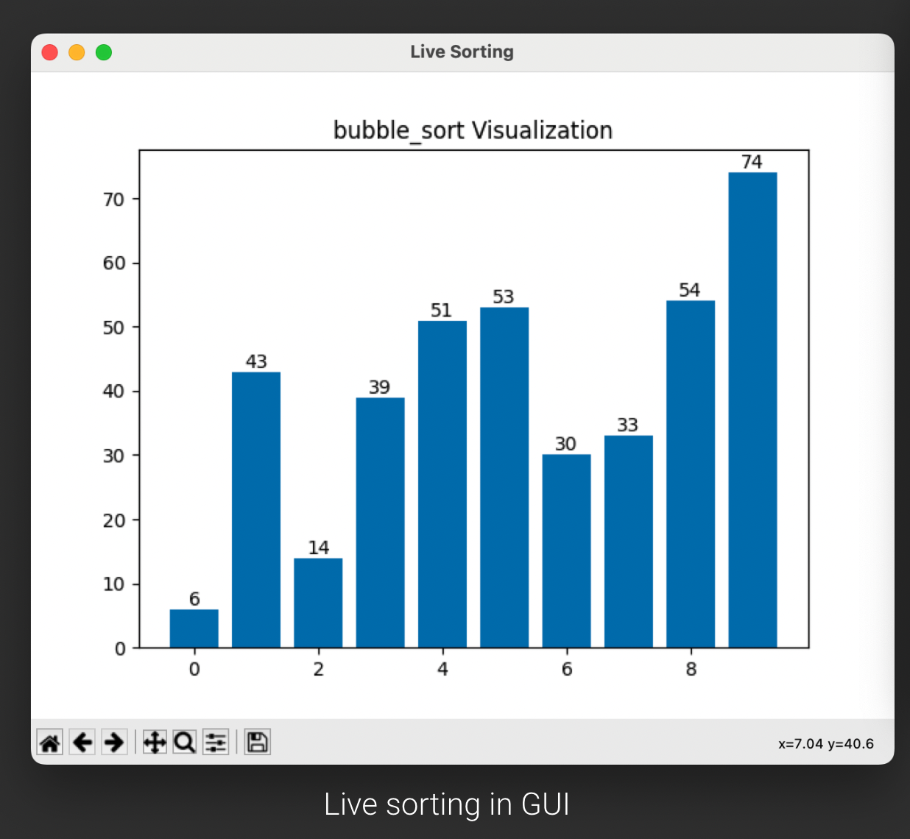
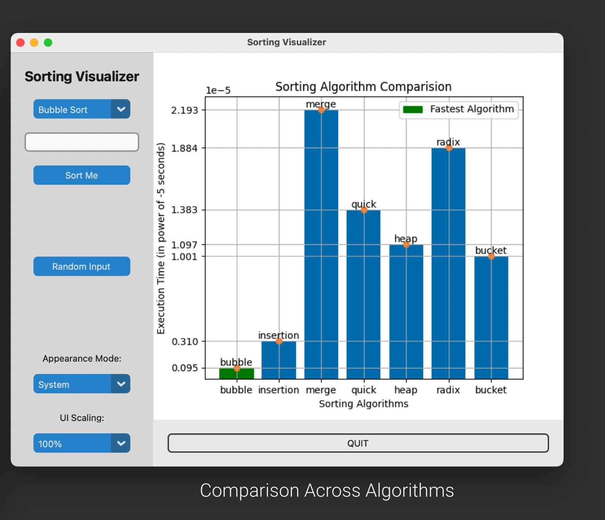

[](https://github.com/KR-Ravindra/sort-analyzer/actions/workflows/pytest.yml)

# sort-analyzer
An alogrithm efficiency analyzer tool for few famous sort algorithms

## Visuals




## Pre-requesties
* Python 3.6+ (tested on python version: `Python 3.11` - Mac OS)

## Setup
```bash
$ git clone https://github.com/KR-Ravindra/sort-analyzer && cd sort-analyzer
$ python3 -m venv .env
$ source .env/bin/activate
(.env) $ pip3 install -r requirements.txt # Install dependencies from the file 'requirements' in current directory to your local environment
```

## Getting Started
```bash
$ python3 main.py
# Asks for user input of an array and algo_name, else defaults to bubble sort and predefined elements
```

## To Contributors
```bash
(.env) $ pip3 freeze > requirements.txt
$ git add . && git commit -m "My Fancy Commit Message"
$ git push origin mybranchname
```

## Running Test Cases
```bash
# set your environment variable so you can find the algorithms/visualizer or any folder
$ export PYTHONPATH=$PYTHONPATH:$PWD/algorithms 
$ pytest # Run all test cases with coverage report
```
## Contribution
```bash
No particular rules, Thank you for contributions!
```